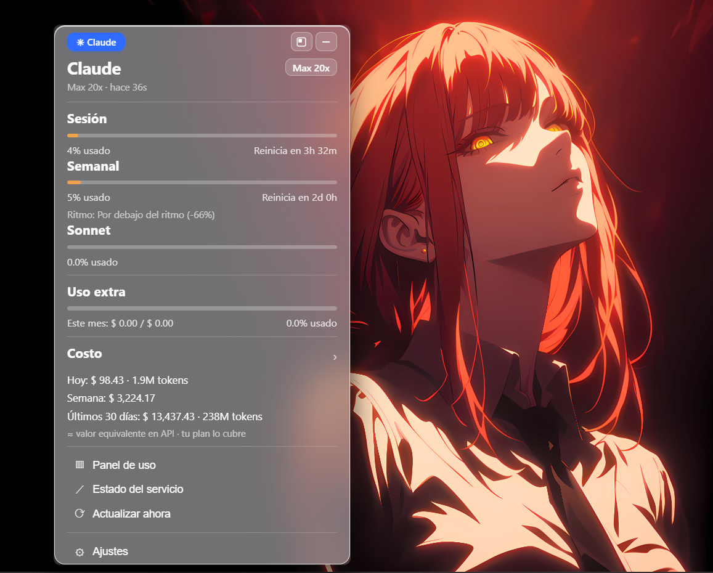

# Claude Bar

> Mira el uso de tu suscripción de **Claude** desde la bandeja de Windows: límite de sesión, límite semanal y costo, siempre a un clic.




Una pequeña app tipo *menu bar* para Windows que muestra cuánto has usado de tu plan de Claude. Hecha con **Rust + Tauri 2**, así que consume poca RAM (~50 MB) y el binario pesa ~3.6 MB.

> Creado por **Daybi** · *build in public* · open source (MIT)

## Por qué

- **Tus límites de un vistazo** — el icono de la bandeja muestra el % de tu sesión de 5 horas, así siempre sabes cómo vas.
- **Sin abrir paneles** — sesión, semanal, Sonnet y costo, directo en la bandeja.
- **Privado por diseño** — todo se lee **localmente** en tu PC. Sin servidores, sin telemetría, sin la cuenta del autor de por medio.
- **Liviano** — usa el WebView2 nativo de Windows (sin Chromium empaquetado), así que puede estar abierto todo el día.

## Qué muestra

- **Sesión** — el límite de 5 horas: % usado y cuándo se reinicia.
- **Semanal** — el límite de 7 días: % usado, hora de reinicio y "ritmo".
- **Sonnet** — la ventana semanal específica del modelo.
- **Uso extra** — gasto extra del mes (si lo tienes habilitado en tu cuenta).
- **Costo** — hoy / semana / últimos 30 días, como **valor equivalente en API** (lo que pagarías por uso; tu plan lo cubre).
- **Plan exacto** — por ejemplo `Max 20x`, según tu nivel de límites.
- Interfaz *glassmorphism* · movible · modos minimizar / compacto · notificaciones de Windows · español e inglés.

## Instalación

**Requisitos:** Windows 10/11 y **Claude Code** instalado e iniciado sesión (Claude Bar lee tu sesión local de Claude Code — ver *Cómo funciona*).

1. Descarga el instalador `Claude Bar_0.1.0_x64-setup.exe` desde [**Releases**](https://github.com/daybigo/ClaudeBar/releases/latest).
2. Ejecútalo (se instala en tu usuario, sin admin). SmartScreen de Windows puede avisar por ser una app sin firmar → **Más información → Ejecutar de todas formas**.
3. El panel aparece la primera vez; después vive en la bandeja. Puede iniciar con Windows (se activa en el menú del icono).

## Cómo funciona

Todo se lee localmente en tu máquina:

| Dato | Origen |
|------|--------|
| Sesión / Semanal / Sonnet / Extra | `GET https://api.anthropic.com/api/oauth/usage` con el token OAuth local de Claude Code |
| Token + nivel de plan | `%USERPROFILE%\.claude\.credentials.json` |
| Costo y tokens | analizando `%USERPROFILE%\.claude\projects\**\*.jsonl` |

- El token se **lee** del archivo que Claude Code ya mantiene; nunca se empaqueta ni se envía a ningún lado, salvo al propio endpoint de uso de Anthropic.
- El endpoint de uso tiene límite de peticiones, así que Claude Bar consulta cada **5 min** (con reintentos). El costo se recalcula cada **60 s**.
- El costo es una **estimación** (Claude Code no guarda el costo real; se calcula a partir de los tokens con una tabla de precios local).

### Dónde guarda sus datos Claude Bar

Claude Bar casi no guarda nada propio:

- **Marca de primer arranque** + datos del WebView (preferencia de idioma): `%APPDATA%\com.daybi.claudebar\` y `%LOCALAPPDATA%\com.daybi.claudebar\`.
- **Inicio con Windows**: una entrada `Claude Bar` en `HKCU\Software\Microsoft\Windows\CurrentVersion\Run`.
- **La app**: `%LOCALAPPDATA%\Claude Bar\`.
- **No** copia ni guarda tu token de Claude — lo lee en vivo de `~/.claude/.credentials.json` cada vez.

## Características

- Icono de bandeja con el % de la sesión dibujado dentro (verde → ámbar → rojo).
- Clic en el icono para abrir/cerrar; **arrastra la barra superior** para mover la ventana a donde quieras.
- **Minimizar** a la bandeja, o **modo compacto** (un widget pequeño siempre encima, en la esquina, mostrando solo Sesión + Semanal).
- **Notificaciones** cuando se reinicia tu sesión de 5 horas, cuando llegas al límite de sesión y cuando se reinicia tu límite semanal.
- **Idiomas**: español (por defecto) e inglés, se cambia abajo.
- **Glassmorphism**: interfaz translúcida, difuminada y clara.

## Privacidad

Claude Bar es de solo lectura y funciona sin conexión primero. Solo habla con `api.anthropic.com` (el mismo endpoint de uso que usa Claude Code) y lee archivos en tu propio disco. Sin analítica, sin servidores de terceros. El código es abierto: audítalo.

> Nota sobre cuentas: Claude Bar usa **tu propia** sesión local de Claude Code. **No** implementa un inicio de sesión de terceros, a propósito — reutilizar el cliente OAuth de Claude para logins de terceros va contra los Términos de Anthropic. Para cambiar de cuenta, cierra/inicia sesión dentro de Claude Code.

## Compilar desde el código

Requisitos: [Rust](https://rustup.rs/) (se recomienda el toolchain MSVC), [Node.js](https://nodejs.org/) y Windows con WebView2 (ya viene en Win 11).

```powershell
npm install                       # dependencias del frontend (una vez)
npm run tauri dev                 # desarrollo, con recarga en caliente
npm run tauri build               # instalador release (NSIS) en src-tauri/target/release/bundle/nsis/
npm run tauri build --no-bundle   # solo el .exe portable
```

Estructura:

```
claudebar/
├─ index.html · src/main.ts · src/styles.css   # interfaz (i18n, glass)
└─ src-tauri/src/
   ├─ main.rs · lib.rs        # bandeja, ventana, polling, notificaciones
   ├─ credentials.rs          # lee el token local + el plan
   ├─ claude_api.rs           # endpoint oauth/usage
   ├─ cost.rs · pricing.rs    # costo desde los logs jsonl locales
   └─ tray_icon.rs            # dibuja el % dentro del icono de la bandeja
```

## Créditos

Inspirado en [CodexBar](https://github.com/steipete/codexbar) de Peter Steinberger, pero para Windows.

## Licencia

MIT © Daybi
